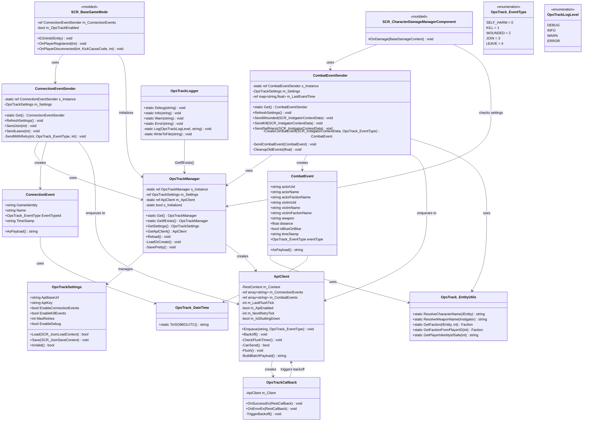
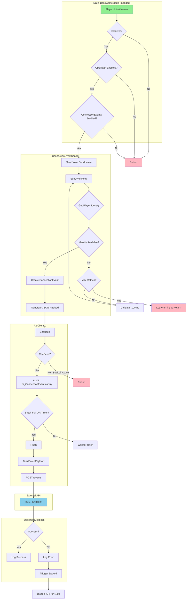

# OpsTrack Refactoring - Komplet Dokumentation

## Indholdsfortegnelse
1. [Changelog](#changelog)
2. [Klassediagram](#klassediagram)
3. [Flow Diagram: ConnectionEvent](#flow-diagram-connectionevent)
4. [Flow Diagram: CombatEvent](#flow-diagram-combatevent)
5. [Detaljeret Forklaring af Ændringer](#detaljeret-forklaring-af-ændringer)

---

# Changelog

## Version 2.0.0 - Refaktorering

### 🔴 Kritiske Fixes

| Fil | Problem | Løsning |
|-----|---------|---------|
| `OpsTrackLogger.c` | FileHandle blev aldrig lukket efter skrivning (memory/resource leak) | Tilføjet `fh.Close()` efter `fh.WriteLine()` |
| `OpsTrack_CharacterDamageManagerComponent.c` | Null pointer crash ved `GetSettings().EnableKillEvents` | Tilføjet sikker null-check med `GetIfExists()` pattern |
| `CombatEvent.c` | `GetBackendApi()` kunne returnere null og crashe | Bruger nu `OpsTrack_EntityUtils.GetPlayerIdentityIdSafe()` |

### 🟡 Strukturelle Forbedringer

| Ændring | Beskrivelse |
|---------|-------------|
| Ny fil: `OpsTrack_EntityUtils.c` | Samler 4 duplikerede metoder ét sted |
| Ny metode: `OpsTrackManager.GetIfExists()` | Returnerer null i stedet for at oprette instans (til sikker adgang under startup) |
| Ny metode: `RefreshSettings()` | På CombatEventSender og ConnectionEventSender for runtime reload |
| Ny metode: `OpsTrackSettings.IsValid()` | Validerer settings ved load |
| Fjernet død kode | `BuildPayload()` i ConnectionEventSender blev aldrig brugt |

### 🟢 Mindre Forbedringer

| Ændring | Beskrivelse |
|---------|-------------|
| API key logges ikke | Sikkerhedsforbedring - API key fjernet fra debug logs |
| Bedre bool-til-JSON | Explicit `"true"`/`"false"` strings i stedet for `ToString()` |
| Konsistent null-checks | Alle offentlige metoder tjekker for null input |
| Bedre log-beskeder | Mere informative og konsistente log-meddelelser |

### 📁 Fil-ændringer

```
TILFØJET:
  OpsTrack/Utils/OpsTrack_EntityUtils.c    (NY - shared utilities)

FJERNET:
  (ingen filer fjernet, kun død kode internt)

MODIFICERET:
  GameMode/OpsTrack_BaseGameMode.c
  OpsTrack/CombatEvent/CombatEvent.c
  OpsTrack/CombatEvent/CombatEventSender.c
  OpsTrack/ConnectionEvent/ConnectionEvent.c
  OpsTrack/ConnectionEvent/ConnectionEventSender.c
  OpsTrack/ConsoleCommands/OpsTrackReloadCommand.c
  OpsTrack/Logger/OpsTrackLogger.c
  OpsTrack/OpsTrackCallback.c
  OpsTrack/OpsTrackManager.c
  OpsTrack/OpsTrack_ApiClient.c
  OpsTrack/Settings/OpsTrackSettings.c
  OpsTrack/Utils/OpsTrack_DateTime.c
  OpsTrack_CharacterDamageManagerComponent.c
```

---

# Klassediagram



---

# Flow Diagram: ConnectionEvent



---

# Flow Diagram: CombatEvent

```mermaid
flowchart TD
    subgraph DamageSystem["SCR_CharacterDamageManagerComponent (modded)"]
        A1[OnDamage Called]
        A2{IsServer?}
        A3{Manager Exists?}
        A4{KillEvents Enabled?}
        A5{Victim Valid?}
        A6{Already Dead?}
        A7{Has Instigator?}
        A8[Create SCR_InstigatorContextData]
    end

    subgraph Sender["CombatEventSender"]
        B1[SendWounded / SendKill / SendSelfHarm]
        B2[CreateCombatEvent]
        B3{Spam Protection Check}
        B4[Cleanup Old Events]
        B5[Resolve Character Names]
        B6[Resolve Factions]
        B7[Calculate Distance]
        B8[Resolve Weapon]
        B9[Determine TeamKill]
        B10[Create CombatEvent Object]
        B11[SendCombatEvent]
        B12[Generate JSON Payload]
    end

    subgraph Utilities["OpsTrack_EntityUtils"]
        U1[ResolveCharacterName]
        U2[GetFaction]
        U3[ResolveWeaponName]
        U4[GetPlayerIdentityIdSafe]
    end

    subgraph ApiClient["ApiClient"]
        C1[Enqueue]
        C2{CanSend?}
        C3[Add to m_CombatEvents array]
        C4{Batch Full OR Timer?}
        C5[Flush]
        C6[BuildBatchPayload]
        C7[POST /events]
    end

    subgraph External["External API"]
        E1[REST Endpoint]
    end

    %% Damage System Flow
    A1 --> A2
    A2 -->|No| X1[super.OnDamage & Return]
    A2 -->|Yes| A3
    A3 -->|No| X1
    A3 -->|Yes| A4
    A4 -->|No| X1
    A4 -->|Yes| A5
    A5 -->|No| X1
    A5 -->|Yes| A6
    A6 -->|Yes| X1
    A6 -->|No| A7
    A7 -->|No| X1
    A7 -->|Yes| A8
    A8 --> B1

    %% Sender Flow
    B1 --> B2
    B2 --> B3
    B3 -->|Spam Detected| X2[Return null]
    B3 -->|OK| B4
    B4 --> B5
    B5 --> U1
    U1 --> B6
    B6 --> U2
    U2 --> B7
    B7 --> B8
    B8 --> U3
    U3 --> B9
    B9 --> B10
    B10 --> U4
    U4 --> B11
    B11 --> B12
    B12 --> C1

    %% API Client Flow
    C1 --> C2
    C2 -->|No| X3[Return]
    C2 -->|Yes| C3
    C3 --> C4
    C4 -->|No| X4[Wait]
    C4 -->|Yes| C5
    C5 --> C6
    C6 --> C7
    C7 --> E1

    style A1 fill:#FFD700
    style E1 fill:#87CEEB
    style X1 fill:#FFB6C1
    style X2 fill:#FFB6C1
    style X3 fill:#FFB6C1
```



---

# Detaljeret Forklaring af Ændringer

## 1. FileHandle Resource Leak Fix

### Problem
I den originale `OpsTrackLogger.c` blev `FileHandle` åbnet men aldrig lukket:

```c
// ORIGINAL KODE
FileHandle fh = FileIO.OpenFile(logPath, FileMode.APPEND);
if (fh)
{
    fh.WriteLine(line);
    // FileHandle forbliver åben!
}
```

Dette medfører:
- **Memory leak**: Hver log-linje allokerer resources der aldrig frigives
- **File locking**: Filen kan blive låst og umulig at åbne andre steder
- **Crash over tid**: Efter nok åbne handles crasher serveren

### Løsning
```c
// REFAKTORERET KODE
FileHandle fh = FileIO.OpenFile(logPath, FileMode.APPEND);
if (fh)
{
    fh.WriteLine(line);
    fh.Close();  // TILFØJET
}
```

---

## 2. GetIfExists() Pattern

### Problem
`OpsTrackLogger` brugte `OpsTrackManager.Get()` som kunne starte en initialiseringsløkke:

```
Logger → Get() → Opretter Manager → Logger → Get() → ...
```

### Løsning
Ny metode der returnerer `null` hvis manager ikke eksisterer:

```c
// Ny metode i OpsTrackManager
static OpsTrackManager GetIfExists()
{
    return s_Instance;  // Returnerer null hvis ikke initialiseret
}

// Bruges i Logger
OpsTrackManager manager = OpsTrackManager.GetIfExists();
if (manager)
    settings = manager.GetSettings();
```

---

## 3. Null-check i CharacterDamageManagerComponent

### Problem
Direkte kædet kald kunne crashe:

```c
// ORIGINAL - Crasher hvis GetSettings() returnerer null
if (!OpsTrackManager.Get().GetSettings().EnableKillEvents)
```

### Løsning
```c
// REFAKTORERET - Sikker null-check
OpsTrackManager manager = OpsTrackManager.GetIfExists();
if (!manager)
{
    super.OnDamage(damageContext);
    return;
}

OpsTrackSettings settings = manager.GetSettings();
if (!settings || !settings.EnableKillEvents)
{
    super.OnDamage(damageContext);
    return;
}
```

---

## 4. OpsTrack_EntityUtils - Eliminering af Duplikeret Kode

### Problem
Fire metoder var copy-pasted mellem `CombatEventSender.c` og `OpsTrack_CharacterDamageManagerComponent.c`:
- `ResolveCharacterName()`
- `ResolveWeaponName()`
- `GetFaction()`
- `GetFactionFromPlayerID()`

Dette medfører:
- **Vedligeholdelsesbyrde**: Ændringer skal laves to steder
- **Inkonsistens**: Risiko for at metoderne divergerer over tid
- **Større kodebase**: Unødvendig duplikering

### Løsning
Ny utility-klasse med statiske metoder:

```c
class OpsTrack_EntityUtils
{
    static string ResolveCharacterName(IEntity entity) { ... }
    static string ResolveWeaponName(Instigator inst) { ... }
    static Faction GetFaction(IEntity entity, int playerID) { ... }
    static Faction GetFactionFromPlayerID(int playerID) { ... }
    static string GetPlayerIdentityIdSafe(int playerId) { ... }  // NY
}
```

Nu bruges de sådan:
```c
string name = OpsTrack_EntityUtils.ResolveCharacterName(entity);
```

---

## 5. GetPlayerIdentityIdSafe()

### Problem
`GetBackendApi()` kunne returnere `null`:

```c
// ORIGINAL - Crasher hvis GetBackendApi() er null
this.actorUid = GetGame().GetBackendApi().GetPlayerIdentityId(actorId);
```

### Løsning
Ny utility-metode med null-checks:

```c
static string GetPlayerIdentityIdSafe(int playerId)
{
    if (playerId <= 0)
        return "";
    
    BackendApi api = GetGame().GetBackendApi();
    if (!api)
        return "";
    
    return api.GetPlayerIdentityId(playerId);
}
```

---

## 6. RefreshSettings() Pattern

### Problem
Ved `opstrack_reload` kommando blev singletons ikke opdateret med nye settings.

### Løsning
Ny metode på begge event senders:

```c
// I CombatEventSender og ConnectionEventSender
void RefreshSettings()
{
    OpsTrackManager manager = OpsTrackManager.GetIfExists();
    if (manager)
        m_Settings = manager.GetSettings();
}
```

Reload-kommandoen kalder nu:
```c
manager.Reload();
ConnectionEventSender.Get().RefreshSettings();
CombatEventSender.Get().RefreshSettings();
```

---

## 7. Settings Validering

### Problem
Ugyldige settings blev ikke fanget og kunne forårsage problemer.

### Løsning
Ny `IsValid()` metode:

```c
bool IsValid()
{
    if (!ApiBaseUrl || ApiBaseUrl == "")
    {
        OpsTrackLogger.Error("Settings invalid: ApiBaseUrl is empty");
        return false;
    }
    
    if (!ApiKey || ApiKey == "")
        OpsTrackLogger.Warn("Settings warning: ApiKey is empty");
    
    if (MaxRetries < 0)
        MaxRetries = 0;
    
    if (MaxRetries > 100)
        MaxRetries = 100;
    
    return true;
}
```

---

## 8. API Key Sikkerhed

### Problem
API key blev logget i debug output:

```c
// ORIGINAL
OpsTrackLogger.Debug("Settings loaded: ... ApiKey=" + ApiKey + ...);
```

### Løsning
API key udeladt fra logs:

```c
// REFAKTORERET
OpsTrackLogger.Debug(string.Format(
    "Settings loaded: ApiBaseUrl=%1, EnableConnectionEvents=%2...",
    ApiBaseUrl,
    EnableConnectionEvents,
    // ApiKey IKKE inkluderet
));
```

---

## 9. Bool-til-JSON Konvertering

### Problem
`bool.ToString()` kunne give `"True"`/`"False"` (med stort) som er ugyldig JSON.

### Løsning
Explicit lowercase strings:

```c
// REFAKTORERET
string isTeamKillStr = "false";
if (isBlueOnBlue)
    isTeamKillStr = "true";
```

---

## 10. Fjernet Død Kode

### Problem
`ConnectionEventSender` havde en `BuildPayload()` metode der aldrig blev brugt.

### Løsning
Metoden er fjernet da `ConnectionEvent.AsPayload()` bruges i stedet.

---

## 11. Forbedret Fejlhåndtering i Callbacks

### Problem
`OpsTrackCallback` håndterede ikke null callbacks.

### Løsning
```c
void OnSuccessEx(RestCallback cb)
{
    if (!cb)
    {
        OpsTrackLogger.Warn("OnSuccessEx called with null callback");
        return;
    }
    // ... rest af koden
}
```

---

## Opsummering

| Kategori | Antal Ændringer |
|----------|-----------------|
| Kritiske fejl fixet | 3 |
| Strukturelle forbedringer | 5 |
| Sikkerhedsforbedringer | 1 |
| Kode-eliminering | 2 |
| Nye utility-metoder | 2 |

Den refaktorerede kode er mere robust, lettere at vedligeholde, og har færre potentielle crash-scenarier.
